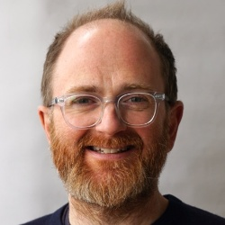
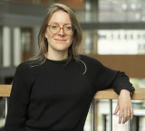
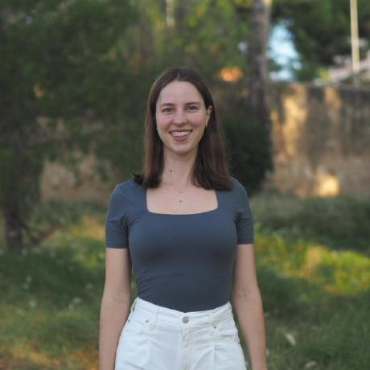
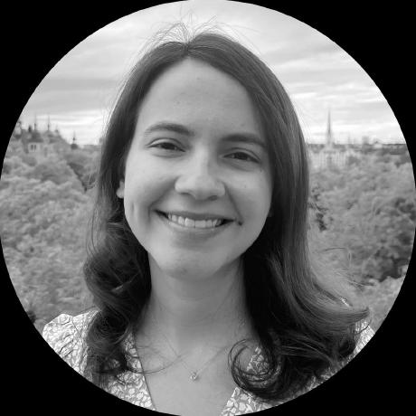

---

:spiral_calendar: May 06, 2026\
:alarm_clock: 08:30 – 10:15 (CEST)\
:hotel: Room -2.82, Austria Center Vienna\
:package: All materials: <https://egu26-compound-events-sc.github.io/>

---

## Description

In the past years, the analysis of compound events has emerged as an essential
step to enhance our knowledge of and response to multi-hazard high-impact events
that occur simultaneously or sequentially, causing interconnected or aggravated impacts.
Compound events involve two (or more) events happening together. These can be
independent events (in which the outcome of one event has no effect on the
probability of the other), or dependent events (when the outcome of one event
affects the probability of another). Compound weather, climate or hydrological
events refer to combinations of multiple drivers or hazards that may lead to
large impacts and disasters. These events can be related to extreme conditions
(e.g. storms, heatwaves, floods and droughts), or to combinations of events that
are not themselves extremes but lead to an extreme event or significant impact when combined.

This short course offers conceptual grounding and hands-on experience with
state-of-the-art methods. Two introductory talks cover the typology of compound
events and the evolution of the multi-risk field, including vulnerability
dynamics, policy frameworks, and adaptation challenges.

Two applied sessions provide hands-on training: vine copulas for multivariate
dependence analysis, and large language models for structured impact extraction
from news media.

## Schedule

::: {.schedule-table}

| Time (CEST) | Session | Speaker |
|---|---|---|
| 08:30 – 08:35 | Welcome and overview | Conveners |
| 08:35 – 08:50 | [Introduction I: Overview of compound events](materials/01-intro-compound-events/index.qmd) | Chris White |
| 08:50 – 09:05 | [Introduction II: From single-hazard to multi-risk](materials/02-intro-multi-risk/index.qmd) | Marleen de Ruiter |
| 09:05 – 09:40 | [Application I: Vine copulas for multivariate dependence](materials/03-vine-copulas/index.qmd) | Judith Claassen |
| 09:40 – 10:15 | [Application II: LLM impact extraction from news media](materials/04-llm-impact-extraction/index.qmd) | Taís M. Nunes Carvalho |

:::

## Speakers

::: {.columns .align-items-center}
::: {.column width="20%"}
{.rounded-circle width="130px"}
:::
::: {.column width="80%"}
**Chris White** | University of Strathclyde

Professor Chris White is Head of the Centre for Water, Environment, Sustainability
and Public Health at the University of Strathclyde in Glasgow. His research
quantifies and predicts complex cascading and interconnected multi-hazard risks
across systems and critical infrastructure. He leads several projects and activities including the new ANTICIPATE European COST Action network <a href="https://www.cost.eu/actions/CA24144/" target="_blank">CA24144</a> on extended-range multi-hazard predictions and early warnings (2025-29). He leads&nbsp;multi-hazard interactions and cascading impacts work package of the <a href="https://mediate-project.eu/" target="_blank">MEDiate</a> (<em>Multi-hazard and risk-informed system for enhanced local and regional disaster risk management</em>) project (2022-25) and is a partner in the forthcoming <a href="https://www.norsar.no/projects/together/" target="_blank">TOGETHER</a> (<em>Towards enhanced coordination of disaster risk management and governance through a holistic framework </em><em>for multi-level interaction and communication</em>) project (2025-28), both funded by the Horizon Europe programme of the European Commission. He was also previously co-lead of the applications sub-project of the World Meteorological Organization’s WWRP/WCRP <a style="font-family: -apple-system, BlinkMacSystemFont, 'Segoe UI', Roboto, Oxygen, Ubuntu, Cantarell, 'Open Sans', 'Helvetica Neue', sans-serif;" href="http://s2sprediction.net/" target="_blank">S2S Prediction Project</a> application sub-group.
:::
:::

 

::: {.columns .align-items-center}
::: {.column width="20%"}
{.rounded-circle width="130px"}
:::
::: {.column width="80%"}
**Marleen de Ruiter** | Vrije Universiteit Amsterdam

Marleen de Ruiter is an Assistant Professor in the Department of Water and Climate
Risk at the Institute for Environmental Studies (IVM), Vrije Universiteit Amsterdam.
Her research focuses on multi-hazard risk modelling, early warning systems, and the
temporal dynamics of disaster vulnerability.
She is an expert on consecutive disasters and systemic risk, currently serving as the co-chair of the&nbsp;<a href="https://www.risk-kan.org/" target="_blank">RiskKAN</a>&nbsp;network and co-leading the Amsterdam Sustainability Institute (<a href="https://vu.nl/en/about-vu/research-institutes/amsterdam-sustainability-institute/more-about/asi-cluster-natural-hazards-and-society" target="_blank">ASI</a>) cluster on Natural Hazards &amp; Society. In 2024, she was honored with the&nbsp;<a href="https://www.egu.eu/awards-medals/division-outstanding-ecs-award/2024/marleen-c-de-ruiter/" target="_blank">EGU Natural Hazards Division Outstanding Early Career Scientist</a>&nbsp;award.
:::
:::

 

::: {.columns .align-items-center}
::: {.column width="20%"}
{.rounded-circle width="130px"}
:::
::: {.column width="80%"}
**Judith Claassen** | Vrije Universiteit Amsterdam

Judith Claassen is a researcher at the Institute for Environmental Studies (IVM) at Vrije Universiteit Amsterdam. She earned her bachelor degree in Earth and Environmental Sciences at the Amsterdam University College, and holds a master in Civil Engineering: Water Management from TU Delft. Her research focuses on modelling multi-hazard events using probabilistic methods, such as vine copulas. Her PhD was funded by the Horizon 2020 MYRIAD-EU project, where she also served as the first chair of the Early Career Researcher board.
:::
:::

 

::: {.columns .align-items-center}
::: {.column width="20%"}
{.rounded-circle width="130px"}
:::
::: {.column width="80%"}
**Taís M. Nunes Carvalho** | Helmholtz Centre for Environmental Research

**Placeholder:**Taís M. Nunes Carvalho is ...
:::
:::

## Conveners

- Guilherme Mendoza Guimarães
- Joren Janzing
- Leonore Boelée
- Ilias Pechlivanidis
- Maria-Helena Ramos

*Co-organized by: AS6 · CL6 · HS11 · NH14*
